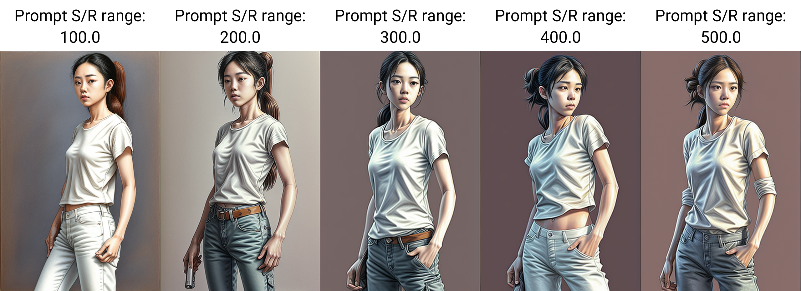

!!!这是我在午间凑合来的简单实现，如果对该功能有大量需求，我会继续完善代码。使用中有任何问题请及时反馈以便我改进，谢谢！
I scrapped together the (very simple) code during lunch break, please do create issues if you encounter any. 

## Features
在X/Y/Z Plot脚本的提示词查找替换功能中，增加了指定整数、小数范围的功能。 Added range support for Prompt S/R in X/Y/Z plot script when applying against integer and float numbers.

该功能允许在提示词查找替换功能的基础上使用整数或小数的范围写法。在测试lora、权重等场景下不需要再将所有替换值一一列出了。The following range syntax are supported. 

- 简单范围：
    - `1-5 = 1, 2, 3, 4, 5`
- 用圆括号指定步长：
    - `1-5 (+2) = 1, 3, 5`
    - `10-5 (-3) = 10, 7`
    - `1-3 (+0.5) = 1, 1.5, 2, 2.5, 3`
- 用方括号指定采样数量
    - `1-10 [5] = 1, 3, 5, 7, 10`
    - `0.0-1.0 [6] = 0.0, 0.2, 0.4, 0.6, 0.8, 1.0`

比如，在X/Y/Z Plot脚本下拉菜单中选中`Prompt S/R Range`并输入`100-500 (+100)`，对于提示词`full body of a woman in white t-shirt and tight jeans, hands in pocket, model shot poses, in the style of pencil-draw-100` 将生成如下结果

## 安装方法 | Installation
### X/Y/Z Plot
- 打开SD webui，在`Extensions（插件）`选项卡中选择`Install from URL(从网页链接安装)`，在输入框中粘贴`https://github.com/AI-skimos/sd-webui-prompt-sr-range`并点击安装按钮。重启webui后可以在X/Y/Z Plot脚本的下拉选单中看到一个新的`Prompt S/R Range` 选项。 Directly `install from URL`, you'll see a new `Prompt S/R Range` option in X/Y/Z script dropdown list after restarting the UI.

## 已知问题 | Known Issue
- 当提示词中有多个查找结果时，会同时替换所有满足查找条件的文本。这并不是本改动造成的，请确保提示词中只有一处查找结果。In case of multiple hits, all instances will be replaced. This is not an issue introduced by this custom feature. Please make sure there's only one hit for the searching criteria in your prompt.
- 目前仅支持整数、小数的查找替换。比如0001-0003会被解析为1-3。Currently only integers and floats are supported, e.g. 0001-0003 will be parsed as 1-3. 

## Credit
Thanks to `Florency(罐罐罐罐罐)` for the idea.

Illustration credit to `codelsy`'s colored pencil drawing dataset.
